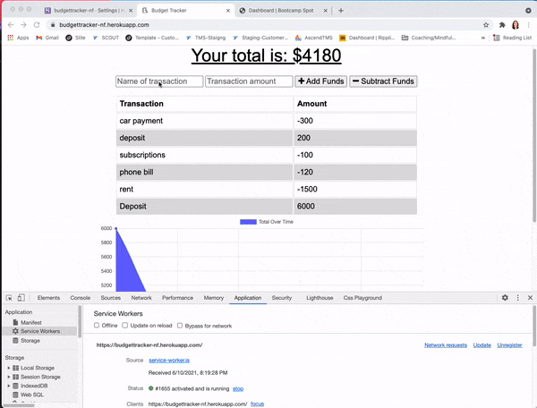

# Budget Tracker

## Description

For this application, I programmed it to be a Progressive Web Application (PWA). Utilizing cache, webmanifest, service workers, and indexedDB the functionality of this application will work if a user is offline, and the data will be saved to the DB once a network connection has been reestablished. It's currently deployed to Heroku with MongoDB Atlas.

## User Story

`AS AN avid traveller I WANT to be able to track my withdrawals and deposits with or without a data/internet connection SO THAT my account balance is accurate when I am traveling`

## Business Context

Giving users a fast and easy way to track their money is important, but allowing them to access that information anytime is even more important. Having offline functionality is paramount to our applications success.

## Acceptance Criteria

`GIVEN a user is on Budget App without an internet connection WHEN the user inputs a withdrawal or deposit THEN that will be shown on the page, and added to their transaction history when their connection is back online.`

## Offline Functionality

- Enter deposits offline

- Enter expenses offline

When brought back online:

- Offline entries should be added to tracker.

## Technologies Used

- Service Workers
- IndexedDB
- Mongoose
- MongoDB & Atlas
- Node.js

## Preview

## Deployed Application

- https://budgettracker-nf.herokuapp.com/

## License

Copyright (c) Natalie Finnegan All rights reserved. 

Licensed under the MIT License

Copyright (c) 2021 - present | Natalie Finnegan

<blockquote>
Permission is hereby granted, free of charge, to any person obtaining a copy
of this software and associated documentation files (the "Software"), to deal
in the Software without restriction, including without limitation the rights
to use, copy, modify, merge, publish, distribute, sublicense, and/or sell
copies of the Software, and to permit persons to whom the Software is
furnished to do so, subject to the following conditions:

The above copyright notice and this permission notice shall be included in all
copies or substantial portions of the Software.

THE SOFTWARE IS PROVIDED "AS IS", WITHOUT WARRANTY OF ANY KIND, EXPRESS OR
IMPLIED, INCLUDING BUT NOT LIMITED TO THE WARRANTIES OF MERCHANTABILITY,
FITNESS FOR A PARTICULAR PURPOSE AND NONINFRINGEMENT. IN NO EVENT SHALL THE
AUTHORS OR COPYRIGHT HOLDERS BE LIABLE FOR ANY CLAIM, DAMAGES OR OTHER
LIABILITY, WHETHER IN AN ACTION OF CONTRACT, TORT OR OTHERWISE, ARISING FROM,
OUT OF OR IN CONNECTION WITH THE SOFTWARE OR THE USE OR OTHER DEALINGS IN THE
SOFTWARE.

</blockquote>

